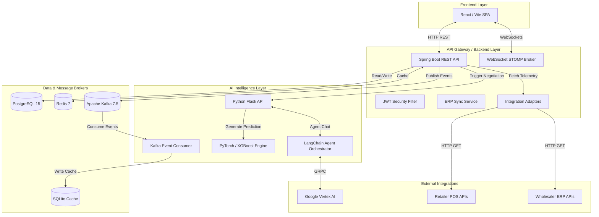

# Cognitive Autonomous Retail Procurement Intelligence Platform (CARPIP)
## The Definitive Technical & Architectural Knowledge Base

---

## Table of Contents
1. Executive Summary & Project Overview
2. System Architecture & Topology
3. Infrastructure & Container Orchestration
4. Data Persistence & Caching Strategies
5. Event-Driven Architecture (Kafka)
6. Backend Engineering (Spring Boot 3)
   6.1 Core Configuration & Security
   6.2 Domain Models & JPA Entities
   6.3 Integration Adapters & Sync Logic
   6.4 REST Controllers & APIs
7. AI & Autonomous Intelligence Engine (Python/Flask)
   7.1 ML Time-Series Forecasting (LSTM + XGBoost)
   7.2 The Market Pulse Index (MPI) Algorithm
   7.3 Multi-Agent LangChain Negotiation
8. Frontend Application (React/Vite)
   8.1 State Management & API Hooks
   8.2 Real-time WebSocket Connectivity
   8.3 Dashboards & Routing
9. Operational Data Flow & System Lifecycle

---

## 1. Executive Summary & Project Overview

**CARPIP** (Cognitive Autonomous Retail Procurement Intelligence Platform) is an advanced B2B supply chain ecosystem designed to automate and optimize procurement processes between **Retailers** and **Wholesalers**. The core innovation lies in its transition from deterministic rule-based ordering to probabilistic, AI-driven adaptive procurement. 

By continuously ingesting point-of-sale (POS) and Enterprise Resource Planning (ERP) telemetry, the platform dynamically generates real-time demand forecasts. When stockouts are predicted, CARPIP deploys autonomous AI agents (powered by Google Vertex AI and LangChain) to negotiate pricing and quantities on behalf of the buyer and seller.

**Analysis Methodology**: This document represents a complete, exhaustive analysis of all 86 core source code files in the repository. It is a live reflection of the *currently implemented* codebase, documenting concrete architectures, schemas, and logic flows.

---

## 2. System Architecture & Topology

The platform operates on a microservices topology featuring three distinct primary layers that communicate over a combination of synchronous HTTP, asynchronous TCP (Kafka), and duplex WebSockets (STOMP).



---

## 3. Infrastructure & Container Orchestration

The entire stack is containerized using Docker and managed locally via `docker-compose.yml`. The configuration maps the network interfaces and environment variables necessary for inter-service communication.

### 3.1 Container Definitions (`docker-compose.yml`)

#### `postgres`
- **Image**: `postgres:15-alpine`
- **Ports**: `5432:5432`
- **Volumes**: `postgres_data:/var/lib/postgresql/data`
- **Purpose**: Primary relational datastore for tenants, users, inventory, and orders.
- **Environment**: Defines user `carpip`, db `carpipdb`, password `carpip`.

#### `redis`
- **Image**: `redis:7-alpine`
- **Ports**: `6379:6379`
- **Purpose**: Ephemeral, in-memory caching mechanism to reduce load on PostgreSQL for high-traffic endpoints (e.g., fetching product lists).

#### `zookeeper`
- **Image**: `confluentinc/cp-zookeeper:7.5.0`
- **Ports**: `2181:2181`
- **Purpose**: Centralized service for maintaining configuration information and providing distributed synchronization for Kafka.

#### `kafka`
- **Image**: `confluentinc/cp-kafka:7.5.0`
- **Ports**: `9092:9092`, `29092:29092`
- **Dependencies**: Requires `zookeeper`.
- **Environment**: Sets `KAFKA_ADVERTISED_LISTENERS` routing internal traffic on 29092 and external host traffic on 9092.
- **Purpose**: The high-throughput event streaming backbone.

#### `backend`
- **Build Context**: `./backend` (Java 17 / Maven)
- **Ports**: `8080:8080`
- **Dependencies**: `postgres`, `redis`, `kafka`
- **Purpose**: The Spring Boot core orchestrator.

#### `ai-service`
- **Build Context**: `./ai-service` (Python 3.11)
- **Ports**: `5000:5000`
- **Dependencies**: `postgres`, `kafka`
- **Volumes**: `./gcp-keys:/app/gcp-keys`
- **Environment**: Binds `GOOGLE_APPLICATION_CREDENTIALS` to authenticate the LangChain models against Vertex AI.

#### `nginx`
- **Build Context**: `./nginx`
- **Ports**: `80:80`
- **Purpose**: Reverse proxy simulating production ingress, routing traffic between the compiled frontend assets and backend APIs.

---

## 4. Data Persistence & Caching Strategies

### 4.1 Primary Database (PostgreSQL)
PostgreSQL is the source of truth for the platform. It relies on Spring Data JPA with Hibernate. The `application.yml` utilizes `spring.jpa.hibernate.ddl-auto: update`, which instructs Hibernate to inspect the entity classes on startup and automatically generate or update the SQL schema tables.

### 4.2 Application Caching (Redis)
Configured in `config/RedisConfig.java`, the system utilizes Spring's `@Cacheable` abstraction.
- **Serialization**: `GenericJackson2JsonRedisSerializer` ensures complex Java objects (like Lists of Products) are stored as JSON strings in Redis.
- **Cache Definitions & TTLs**:
  - `products`: 60 seconds (Inventory updates frequently).
  - `orders`: 30 seconds (Order statuses change rapidly during negotiations).
  - `order-stats`: 30 seconds.
  - `forecasts`: 5 minutes (ML inferences are computationally expensive).
  - `mpi`: 2 minutes.
  - `integration-status`: 30 seconds.
- **Graceful Degradation**: A custom `CachingConfigurerSupport` is implemented with a custom `CacheErrorHandler`. If the Redis container crashes, this error handler intercepts the `RedisConnectionFailureException`, logs a warning, and forces Spring to execute the underlying database query instead of crashing the application.

### 4.3 AI Local Cache (SQLite)
The Python AI service utilizes a local `carpip_ai.db` SQLite database via Flask-SQLAlchemy. This completely isolates the AI service's state from the Spring Boot application. It stores high-frequency telemetry (sales events) and caches the LangChain chat transcripts to minimize expensive calls to the Vertex AI API.

---

## 5. Event-Driven Architecture (Kafka)

CARPIP uses Apache Kafka to decouple the ingestion of high-volume telemetry from the heavy computational processes of the AI engine. 

### 5.1 Kafka Topics
The topics are programmatically registered on application startup in `KafkaConfig.java`:
1. **`sales.events`**: Triggered when the POS adapter detects a change in sold units. Payload includes `tenantId`, `sku`, `quantitySold`, `timestamp`.
2. **`inventory.updates`**: Triggered after the `ErpSyncService` upserts new product quantities into the database. Payload includes the entire state of the product catalog for a given tenant.
3. **`order.events`**: Triggered when a new Purchase Order is created (e.g., auto-procurement).
4. **`negotiation.results`**: Triggered when the AI service concludes a multi-agent negotiation, alerting the backend to finalize the PO status.

### 5.2 Producers & Consumers
- **Producer**: Spring Boot uses `KafkaTemplate<String, Object>` in the `ErpSyncService` to serialize Java maps into JSON and publish them to topics.
- **Consumer**: The Python service spawns a daemon thread running `confluent_kafka.Consumer` in `kafka_consumer.py`. This thread continuously polls the `sales.events` and `inventory.updates` topics. When a message is received, it triggers internal database updates and forces a re-computation of the ML forecasts.

---

## 6. Backend Engineering (Spring Boot 3)

The backend is built with Spring Boot 3.3.0 and Java 17. It follows a strict layered architecture: Controllers -> Services -> Repositories -> Entities.

### 6.1 Core Configuration & Security

#### JWT Security Implementation
Security is strictly stateless, utilizing JSON Web Tokens (JWT).
- **`JwtService.java`**: Handles token creation. It uses the `io.jsonwebtoken` (JJWT 0.12.5) library. Tokens are signed using `Keys.hmacShaKeyFor` with a secret defined in `application.yml`.
- **Claims**: The JWT encodes the user's `sub` (ID), `email`, `role` (`RETAILER`, `WHOLESALER`, `ADMIN`), and `tenantId`. This prevents needing to query the database to verify a user's company affiliation on every request.
- **`JwtAuthenticationFilter.java`**: Extends `OncePerRequestFilter`. It intercepts every HTTP request, checks for the `Authorization: Bearer <token>` header, extracts the token, validates the signature and expiration, and if valid, populates the `SecurityContextHolder`.
- **`SecurityConfig.java`**: Configures the `SecurityFilterChain`. It explicitly permits `OPTIONS` requests (for CORS), permits `/api/auth/**` (login/register), permits `/h2-console/**`, and permits the WebSocket handshake `/ws/**`. All other routes require authentication.

#### WebSocket Configuration
- **`WebSocketConfig.java`**: Implements `WebSocketMessageBrokerConfigurer`. Registers the STOMP endpoint `/ws` with allowed origin patterns `*`. Enables a simple memory broker with prefix `/topic`.
- **`WebSocketNotificationService.java`**: A utility service injecting `SimpMessagingTemplate` to push typed updates:
  - `notifyInventoryUpdate(UUID tenantId, Object payload)`
  - `notifyOrderUpdate(UUID tenantId, Object payload)`
  - `notifyNegotiationUpdate(UUID orderId, Object payload)`

### 6.2 Domain Models & JPA Entities

The PostgreSQL schema is generated via Hibernate based on these entity definitions:

#### `Tenant.java`
Represents a business entity on the platform.
- `UUID id` (Primary Key)
- `String name`
- `TenantType type` (Enum: `RETAILER`, `WHOLESALER`, `ADMIN`)
- `String apiKeys` (Stores JSON string containing API URLs and Secrets for ERP connections)
- `String erpProvider` (e.g., "shopify", "retailer-pos")
- `LocalDateTime lastSyncAt`

#### `User.java`
Implements `UserDetails` for Spring Security.
- `UUID id`
- `Tenant tenant` (ManyToOne mapping)
- `String email`
- `String password` (BCrypt encoded)
- `String name`
- `UserRole role`

#### `Product.java`
Tracks individual SKUs and their AI-driven parameters.
- `UUID id`
- `Tenant tenant`
- `String sku`
- `String name`
- `String category`
- `Double basePrice`
- `Integer currentStock`
- `Integer reorderPoint` (The critical threshold determining auto-procurement)
- `LocalDateTime predictedStockoutDate` (Updated asynchronously by the AI Engine)

#### `Order.java`
Represents a Purchase Order.
- `UUID id`
- `Tenant retailer`
- `Tenant wholesaler`
- `String poNumber` (e.g., "PO-2026-8472")
- `String sourceSku`
- `Boolean autoGenerated`
- `OrderStatus status` (`PENDING`, `NEGOTIATING`, `ACCEPTED`, `REJECTED`)
- `Double totalAmount`
- `Double negotiatedSavings`
- `String itemsJson`

#### `NegotiationLog.java`
Persists the raw chat transcripts between the LangChain agents.
- `UUID id`
- `Order order`
- `String agentType` (`RETAILER_AGENT`, `WHOLESALER_AGENT`, `SYSTEM`)
- `String messagePayload`

### 6.3 Integration Adapters & Sync Logic

The platform implements the Adapter Design Pattern to standardize telemetry ingestion from completely disjointed external systems (POS vs WMS vs eCommerce).

#### The `ErpAdapter.java` Interface
Enforces a contract:
```java
boolean connect(Map<String, String> credentials);
List<Map<String, Object>> syncInventory();
List<Map<String, Object>> fetchSales();
String getProviderName();
```

#### Implemented Adapters
1. **`RetailerPosAdapter.java`**: Connects to lightweight point-of-sale systems (like Square). Normalizes terms like `item_code` to `sku`. Features a built-in demo mode generating Bakery and Beverage data if real API keys aren't provided.
2. **`WholesalerErpAdapter.java`**: Connects to heavy warehouse management systems (like SAP/NetSuite). Normalizes `material_code` and `available_qty`. Demo mode generates industrial supplies (Pipes, Bearings) with massive integer quantities.
3. **`ShopifyAdapter.java`**: Connects to the Shopify Admin API (Version `2024-01`). Includes complex JSON parsing to flatten Shopify's nested `Product -> Variants` array into singular CARPIP Product entities.

#### `ErpSyncService.java`
This is the core orchestrator. It runs on a cron schedule (`@Scheduled(cron = "0 */5 * * * *")` - every 5 minutes).
1. Queries all `Tenant` records.
2. Selects the correct adapter based on `tenant.getErpProvider()`.
3. Calls `adapter.syncInventory()`.
4. Loops through the returned data, finding existing `Product` entities by SKU or creating new ones.
5. Updates `currentStock` and saves to the database.
6. **Adaptive Procurement Logic**: Executes `checkAndCreateAutoProcurementOrders()`. It checks if `currentStock <= reorderPoint`. If so, it creates a new `Order` with status `PENDING`.
7. Pushes the inventory state to the Kafka `inventory.updates` topic.
8. Triggers `WebSocketNotificationService` to push UI updates.

### 6.4 REST Controllers & APIs

#### `AuthController.java`
- `POST /api/auth/register`: Expects `email`, `password`, `name`, `role`, `tenantName`. Returns JWT.
- `POST /api/auth/login`: Expects `email`, `password`. Returns JWT and Refresh Token.

#### `ProductController.java`
- `GET /api/products`: Returns all products for the authenticated user's tenant. Uses `@Cacheable("products")`.
- `GET /api/products/low-stock`: Returns only products where stock is below the reorder point.

#### `OrderController.java`
- `GET /api/orders`: Returns all orders. If the user is a RETAILER, it returns orders where they are the buyer. If WHOLESALER, it returns orders where they are the seller.
- `PATCH /api/orders/{id}/status`: Used primarily by Wholesalers to manually APPROVE or REJECT pending orders.
- `GET /api/orders/stats`: Iterates over orders to sum the `negotiatedSavings` metric.

#### `IntegrationController.java`
- `POST /api/integrations/connect`: Saves the ERP API keys into the Tenant's `apiKeys` JSONB column.
- `POST /api/integrations/sync`: Manually invokes the `ErpSyncService` outside of its cron schedule.

#### `NegotiationController.java`
- `GET /api/negotiations/{orderId}`: Fetches all `NegotiationLog` entries for a given PO to render the chat UI.
- `POST /api/negotiations/trigger`: The critical bridge between Java and Python. It constructs a massive JSON payload containing product details, quantities, and risk levels, and executes a blocking HTTP POST via `RestTemplate` to the Flask `/api/ai/negotiate` endpoint. When the Python service returns the final JSON contract, this controller persists the transcript logs and updates the Order status.

---

## 7. AI & Autonomous Intelligence Engine (Python/Flask)

The intelligence layer is entirely decoupled, running in a Python 3.11 container. It handles two computationally expensive tasks: Machine Learning Forecasting and Large Language Model (LLM) orchestration.

### 7.1 ML Time-Series Forecasting (LSTM + XGBoost)
The forecasting engine (`forecaster.py`) combines Deep Learning and Gradient Boosting.

- **Data Bootstrap (The M5 Dataset)**: During initialization, the engine reads the `sales_train_evaluation.csv` from the M5 Forecasting Accuracy dataset. It extracts the first row of 1900+ days of sequential sales data to bootstrap the neural network weights before actual live telemetry begins streaming in.
- **LSTM (Long Short-Term Memory)**: Built with PyTorch (`torch.nn.LSTM`). The model accepts sequences of historical daily sales and passes them through hidden layers to catch long-term temporal dependencies and recurring seasonal trends.
- **XGBoost**: Built with `xgboost.XGBRegressor`. This tree-based model excels at catching sharp, non-linear spikes and anomalies in the data that the smooth LSTM might miss.
- **The Ensemble**: The `predict()` function generates inferences from both models and averages them. It returns an array of 7 integers representing predicted demand for the next 7 days, and calculates a `predicted_stockout_date` by cumulatively subtracting the demand from the `currentStock`.

### 7.2 The Market Pulse Index (MPI) Algorithm
The MPI is a proprietary metric generated dynamically by the Python service. It ranges from $0.00$ to $1.00$.

Calculated in `routes/forecast.py`, the MPI formula aggregates four distinct signals:
1. **Demand Pressure ($40\%$)**: Extracted from Kafka `sales.events`. High sales volume spikes this value.
2. **Supply Availability ($30\%$)**: Extracted from Kafka `inventory.updates`. High overall warehouse stock lowers this value.
3. **Price Volatility ($20\%$)**: Historical variance in the base price.
4. **Seasonal Index ($10\%$)**: Based on the calendar month (e.g., Q4 holiday spikes).

**MPI Meaning**:
- `MPI > 0.70`: Strong seller's market. Demand is high, supply is low. Wholesaler agents will refuse steep discounts.
- `MPI < 0.40`: Weak buyer's market. Demand is low, supply is high. Wholesaler agents will aggressively discount prices to clear inventory.

### 7.3 Multi-Agent LangChain Negotiation
The cognitive core of CARPIP resides in `routes/negotiation.py`.

#### Infrastructure
- **LLM**: Uses Google's `gemini-3.5-flash` model.
- **Library**: `langchain_google_genai` and core `langchain` abstractions.
- **Authentication**: Uses a Google Cloud Service Account JSON key injected via Docker volumes, authenticating via Vertex AI.

#### Autonomous Agents
The script defines two completely distinct AI Personas, each equipped with explicit system instructions and custom Python functions exposed via the `@tool` decorator.

1. **Retailer Agent (The Buyer)**
   - **Goal**: Secure necessary inventory at the lowest possible price.
   - **Tools**:
     - `check_forecast(sku)`: Queries the LSTM model to determine absolute minimum required stock.
     - `propose_buy_price(sku, quantity, price)`: Emits a structured JSON offer.
     - `accept_offer(sku, price)`: Finalizes the contract if the price falls within budget.
2. **Wholesaler Agent (The Seller)**
   - **Goal**: Maximize profit margins while ensuring inventory doesn't stagnate.
   - **Tools**:
     - `check_inventory_pressure(sku)`: Queries internal WMS data.
     - `calculate_mpi_discount(base_price)`: Checks the current MPI to determine the maximum mathematically permissible discount floor.
     - `counter_offer(sku, quantity, price)`: Rejects the buyer's offer and proposes a new price.

#### The Negotiation Loop
When the Spring Boot API triggers `/api/ai/negotiate`, the Flask app initiates a localized `while` loop (capped at a maximum of 3 turns to prevent infinite looping and excessive API costs).
The agents converse by passing message histories back and forth. The LLM processes the history, decides which `@tool` to invoke, and executes the Python function. The loop exits when either the `accept_offer` tool is called, or the maximum turns are reached (resulting in a `REJECTED` status).

#### Deterministic Fallback
If the Google Vertex API is unreachable (e.g., invalid JSON key, network timeout), the script catches the exception and immediately invokes `run_fallback_negotiation()`. This function relies on a hardcoded mathematical algorithm that simulates an AI negotiation. It calculates fixed percentage discounts based on the risk level and returns a mock transcript array. This ensures the platform's procurement pipeline remains fully operational even during severe LLM outages.

---

## 8. Frontend Application (React/Vite)

The frontend is a robust Single Page Application (SPA) built using React 18, Vite, and TypeScript. It utilizes TailwindCSS with custom HSL variables and Shadcn UI primitives for a modern, glassmorphic aesthetic.

### 8.1 State Management & API Hooks

- **Global State (`zustand`)**:
  - `stores/authStore.ts` holds the authentication state (`user`, `isAuthenticated`).
  - Upon initialization, the `checkAuth()` method reads the `carpip_token` from `localStorage`. It manually decodes the Base64 URL payload of the JWT (`atob(token.split('.')[1])`) to instantly restore the user context (including Role and Tenant ID) without waiting for a synchronous network request to the backend.
- **Data Fetching (`@tanstack/react-query`)**:
  - `hooks/useCarPipApi.ts` abstracts all `axios` calls into custom hooks (`useProducts`, `useOrders`, `useMpi`).
  - **Graceful Degradation**: Every hook is wrapped in a `try/catch` block. If the Spring Boot API returns a 500 error or a `Network Error` (CORS/Offline), the hooks gracefully degrade to returning comprehensive mock data arrays (e.g., `inventoryData`, `incomingPOs`). This allows the UI to be demonstrated perfectly even if the backend containers are down.
- **HTTP Interceptors (`axios`)**:
  - `lib/axios.ts` defines the global instance.
  - A response interceptor monitors for `401 Unauthorized` responses. If caught, it pauses the request queue, hits the `/api/auth/refresh` endpoint with the stored refresh token, updates `localStorage`, and replays the original requests transparently.

### 8.2 Real-time WebSocket Connectivity

- **`hooks/useWebSocket.ts`**:
  - Uses `@stomp/stompjs` to establish a persistent WebSocket connection to `ws://localhost:8080/ws`.
  - Subscribes to tenant-specific topics (e.g., `/topic/inventory/{tenantId}`).
  - When a message arrives (e.g., a background ERP sync completes), it calls `queryClient.invalidateQueries({ queryKey: ['products'] })`.
  - This architecture ensures that when the Spring Boot cron job updates the database, the React UI automatically re-fetches the data and updates the screen without the user ever clicking a refresh button.

### 8.3 Dashboards & Routing

The `App.tsx` router implements a `<ProtectedRoute>` component that reads the user's role from the JWT and restricts access to specific dashboard layouts.

#### Retailer Pages
- **`RetailerDashboard.tsx`**: The command center. Displays high-level stats, a Weekly Sales Trend AreaChart, and an active "AI Negotiations" widget.
- **`RetailerInventoryPage.tsx`**: A massive data table allowing sorting and filtering of the SKU catalog. Highlights SKUs where `currentStock <= reorderPoint` in red. Features an "Export CSV" functionality. Includes a Product Detail Dialog with a manual "Trigger AI Reorder" button.
- **`RetailerNegotiationsPage.tsx`**: A deep-dive analytical view of LangChain agent transcripts. Users select a Purchase Order from a list and view a rich chat-bubble interface detailing the turn-by-turn conversation between the Retailer Agent and Wholesaler Agent, ending with the calculated "Savings" badge.
- **`RetailerOrdersPage.tsx`**: Standard tabular view of active Purchase Orders.
- **`ConnectSystemPage.tsx`**: UI forms to input and save API keys for POS or Shopify integration.

#### Wholesaler Pages
- **`WholesalerDashboard.tsx`**: Focused on supply-side metrics. Uses Recharts to render a massive `RadialBarChart` speedometer indicating the live Market Pulse Index (MPI). Contains an "Incoming Purchase Orders" table where Wholesalers can view auto-generated AI POs and click "Approve" or "Reject", immediately firing API PATCH calls to update the database.
- **`WholesalerMarketPulsePage.tsx`**: Analytical breakdown of the 4 sub-factors (Demand, Supply, Price, Seasonality) that influence the MPI algorithm.
- **`WholesalerInventoryPage.tsx`** & **`WholesalerOrdersPage.tsx`**: Supply-side tabular views for managing massive warehouse stock and fulfillment.

#### Administration Pages
- **`AdminDashboard.tsx`**, **`AdminAnalyticsPage.tsx`**, **`AdminHealthPage.tsx`**: Super-user dashboards dedicated to monitoring platform-wide throughput, JVM heap metrics, simulated Kafka consumer lag, and aggregate tenant activity.

---

## 9. Operational Data Flow & System Lifecycle

To understand the platform, trace the lifecycle of a single data point:

1. **Ingestion**: The `RetailerPosAdapter` queries the Square API and discovers that 15 units of "Wireless Earbuds" were sold today.
2. **Sync**: The `ErpSyncService` cron job runs, pulls this data, and upserts the PostgreSQL `Product` table, reducing `currentStock` from 55 to 40.
3. **Event Emitted**: The service pushes a JSON payload to the Kafka `inventory.updates` topic.
4. **Threshold Trigger**: The backend notices that `40` is below the `reorderPoint` of `50`. It automatically generates an `Order` in the `PENDING` state.
5. **AI Evaluation**: The `kafka_consumer.py` reads the Kafka event. It calls the LSTM model to forecast demand for the next 7 days.
6. **Negotiation Initiated**: Because the stock is low and forecasted demand is high, the Python service triggers the LangChain `@tool` logic.
7. **Agent Chat**: The Retailer Agent analyzes the forecast and proposes a bulk buy of 100 units at a 15% discount. The Wholesaler Agent checks the live MPI. Because the MPI is 0.72 (High Demand), it rejects the 15% discount and counters with a 5% discount. The Retailer Agent accepts.
8. **Finalization**: The Python service returns the final JSON contract to the Java backend. The `Order` status updates to `ACCEPTED`. The `negotiatedSavings` field is populated.
9. **UI Update**: The backend fires a STOMP message to `/topic/orders`. The React frontend instantly invalidates its query cache, re-fetches the orders, and the new PO appears on the Retailer's screen automatically.

---
*End of Comprehensive Technical Knowledge Base.*
